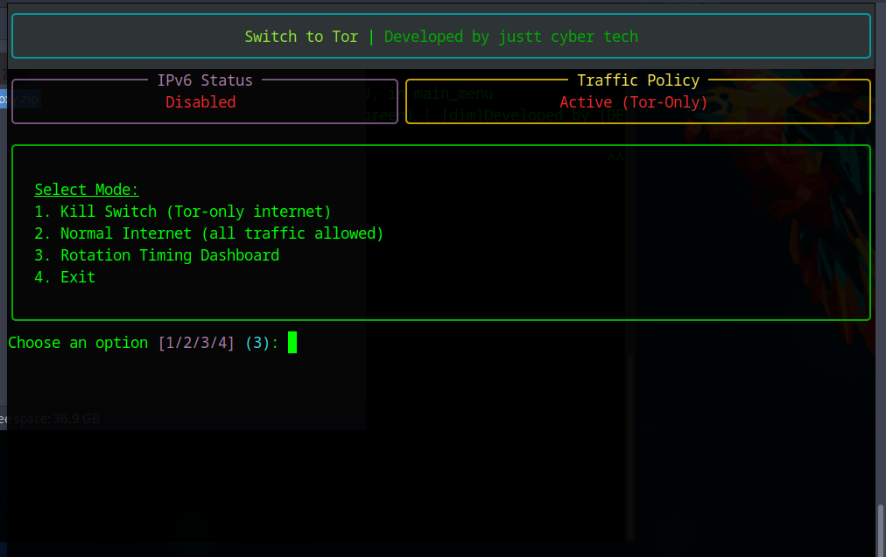

# 🛡️ Tor-Switch

<p align="center">
  
  
  
  
  <br>
  
  
  
</p>

---

## 📖 Overview

**Tor-Switch** is a professional-grade, transparent Tor routing utility designed for Linux systems. It provides a seamless way to route all system traffic through the Tor network, ensuring anonymity and security. Featuring a **hard-coded Kill Switch**, **DNS leak protection**, and **real-time circuit monitoring**, it eliminates the need for complex configurations or third-party scripts.

> *Securing your footprint, one hop at a time.*

---

## 📸 Preview

<p align="center">
  
  <br>
  <i>Modern TUI (Terminal User Interface) built for clarity and speed.</i>
</p>

---

## ✨ Key Features

*   **🌐 Full System Tunneling** – Automatically routes all TCP traffic through the Tor network.
*   **🚫 Fail-Safe Kill Switch** – Prevents "Clear-Net" data leaks by dropping all traffic if the Tor service fails.
*   **🛡️ Multi-Layer Leak Protection** – Hardened rules to block **IPv4**, **IPv6**, and **DNS** deanonymization attempts.
*   **📊 Live Status Dashboard** – Monitor your active Exit IP, Country, and Tor Relay status in real-time.
*   **⚡ Native Implementation** – Direct integration with `iptables` and `stem`; no dependencies on Anonsurf.

---

## 🛠️ System Requirements

| Component | Requirement |
| :--- | :--- |
| **Operating System** | 🐧 Linux (Debian, Ubuntu, Kali, Parrot OS) |
| **Language** | 🐍 Python 3.8+ |
| **Permissions** | 🔑 Root / Sudo (Required for network routing) |
| **Dependencies** | `tor`, `iptables`, `iproute2` |

---

## 🚀 Installation Guide

Follow these steps for a perfect setup. Copy and run each block one by one:

### 1. Update System & Install Core Dependencies
```bash
sudo apt update && sudo apt install -y tor iptables python3 python3-pip
```

### 2. Install Python Packages
```bash
pip3 install requests stem rich
```

### 3. Clone the Repository
```bash
git clone https://github.com/juttcybertech/Tor-Switch.git
cd Tor-Switch
```

### 4. Run Tor-Switch
```bash
sudo python3 app.py
```
> [!NOTE]
> You can also use `sudo python app.py` depending on your environment, but `python3` is recommended.

---

## 🧪 Verified Environments

Tested and confirmed stable on the following distributions:

*   **Parrot Security OS**
*   **Kali Linux**
*   **Ubuntu / Debian**

---

## ⚖️ Legal Disclaimer

> [!WARNING]
> This tool is developed for **educational and privacy research purposes only**. The developers are not responsible for any misuse or illegal activities conducted with this software. Always ensure you are in compliance with your local regulations.

---

<p align="center">
  <b>Developed with ❤️ by Jutt Cyber Tech</b><br>
  <i>Empowering privacy through open-source innovation.</i>
</p>
